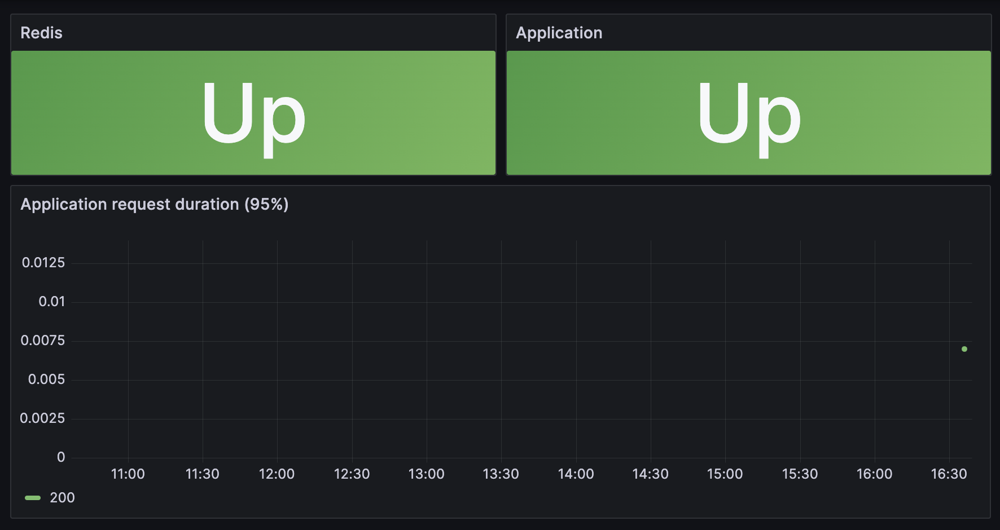

## Docker-compose solution

### Installation
```$ make docker-up```


### Application access

```$ curl localhost:8080```

### Grafana access
```http://localhost:3000```

default user and password: admin/admin

`Monitoring` dashboard displays information about redis and application statuses



### Stop the environment
```make docker-down```


## Minikube solution

### Installation
```$ make minikube-up```

### Application access
```$ make minikube-test```

### Grafana access
1. ```$ kubectl port-forward -n monitoring svc/grafana 3000:3000```

2. ```http://localhost:3000```

    default user and password: `admin`/`admin`

    `Monitoring` dashboard displays information about redis and application statuses

    

### Functional testing
```$ make minikube-test```

### Stop the environment
```$ make minikube-down```